[toc]

# Predicting Market Trends Using XGBoost

## 1. Introduction

Market timing has always been a fascinating topic to investors around the world. This project uses XGBoost to predict market trends of the Shanghai Stock Exchange Composite Index.  

As XGBoost is a powerful and widely-used tool in supervised machine learning, the first step is to create labels and find features that might be predictive to the target variable. 

## 2. Data Processing

### 2.1 Features and Labels

In terms of labeling, this project uses the triple barrier labeling as described by López (2018). The idea of the triple barrier labeling is to form three boundaries, two horizontal and a vertical one. The horizontal boundaries specify the profit-making and stop-loss limits, while the vertical one defines the window length, or the expiration limits. Within the expiration limits, if the lower boundaries is touched first, the observation is labeled to be -1, indicating a falling trend; if the upper boundaries is touched first, then it is labeled 1, indicating a rising trend; if neither of the horizontal boundaries are touched, then it is labeled 0 to signal oscillation. In this way, the value of the target variable, 1, -1, and 0 represents three states of the price trend, namely up, down, and oscillation. 

The asset explored in this project is the Shanghai Security Exchange Composite Index (SH0000001), the target variable is the triple barrier label mentioned above, and the features include mainly technical variables and some external variables which take the trend of  S&P 500 Index, the SGX FTSE China A50 Index Futures Contract, and the Nanhua Commodity Index into account. 

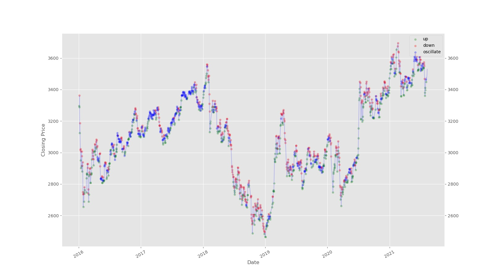

​						Figure 1: triple barrier labeling of the SH000001 index

Figure 1 displays the result of the triple barrier labeling. As can be seen, green dots correspond to the rising states (up), whereas red dots are signals of falling prices (down). The meaning of blue dots seems somewhat ambiguous in the plot, but as the triple barrier method proposes, it represents the oscillation states where the price may go up or move downwards. 

Besides the triple barrier label, another target variable is the next day's closing price. This project uses the `XGBoost Classifier` to predict the  triple barrier label, while the `XGBoost Regressor` is used to build the regression model. 

### 2.2 Lagged Features

Compared to another popular tool LSTM, which is also widely used in time series predictions, it seems that XGBoost cannot take past information into consideration. To overcome this problem, lagged features are added based on their correlation with the target variable (either the triple barrier label or the next day's closing price). The correlation is computed only using the training set, and only the lagged features that has a relatively higher correlation are considered. 

## 3. Models

### 3.1 Specifications of Windows

Windows split the whole sample period into smaller ones, and a model is trained on each of the window, enabling the incorporation of new information and parameter updates. This project uses three kind of windows: a fixed window, rolling windows and recursive windows.

#### 3.1.1 Single fixed window

A single fixed window is roughly the same as the one step train-test split. A model is trained on the training set, then it is used to generate predictions on the test set. One thing needs attention is that lags are used to avoid data snooping bias. As the label uses future closing price, at the end of the training set, the future five days' closing prices are already known. To make the predictions practicable, these five days should be excluded from the test set. In the case of regression, as the target variable is the next day's closing price, a one-day lag is used between the end of the training set and the beginning of the test set. The structure of the single fixed window is shown in Figure 2. 

​						Figure 2: one fixed window

#### 3.1.2 Rolling window

The single fixed window can be the basic element of rolling windows and recursive windows. In the setting of a rolling window, as Figure 3 displays, models are re-estimated on each of the windows.  Rolling windows are composed of single fixed windows that move forward. The benefit of rolling window may be that it allows the parameters to change in a period of time, therefore incorporating new information.

​						Figure 3: rolling window

#### 3.1. 3 Recursive window 

Recursive windows are very similar to the rolling ones. The only difference between the two is that the recursive windows expand the training set as time goes by, for all of the windows have the same begin index of the training set. Figure 4 illustrates those recursive windows. 

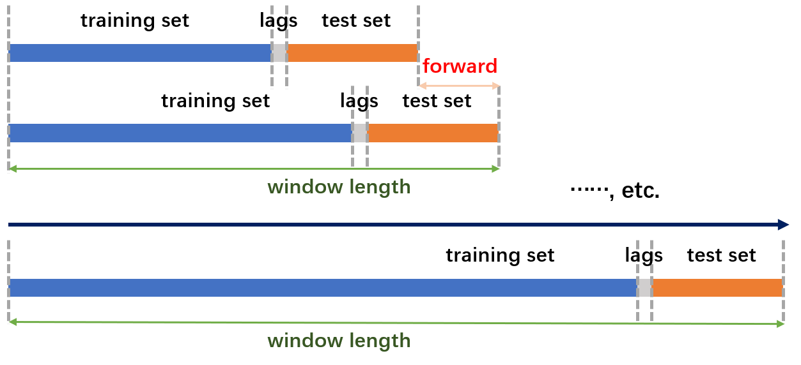

​						Figure 4: recursive window

### 3.2 Parameter Tuning

As XGBoost has many parameters and the tuning process can be very time-consuming, this project only tunes the `num_boost_round` which denotes the number of trees built in the model. This parameter controls the complexity, as more trees being built, it is more possible that the model will overfit the training set and adapt poorly to the test data. 

To  mitigate the overfitting problem, early stop is used by specifying the `early_stopping_rounds` parameter in a k-fold cross validation. If for a given number of rounds, the hold-out metric does not improve on the validation set, the model will stop adding new trees into it and stop therefore training. The training and validation process is conducted on the training set only.

## 4. Results

### 4.1 XGBoost Classification

Firstly, a XGBoost Classifier is used to predict the triple barrier label. The triple barrier label, which takes the value of -1, 0, and 1, corresponds to the falling , oscillating, and rising states respectively. 

#### 4.1.1 Single fixed window

Let $M$ be the number of the label's unique values (in this case three) , $m$ denotes the label's $m^{th}$ value, $N$ be the number of samples, and $n$ denotes the $n^{th}$ sample. The metric used in the 5-folds cross validation is the `mlogloss`, specified by the following equation:
$$
mlogloss = -\frac{1}{M}\sum_{m=1}^{M}\frac{1}{N}\sum_{n=1}^{N}(y_{n,m}log(\hat y_{n,m})+(1-y_{n,m})log(1-\hat y_{n,m}))
$$
Figure 5 plots the value of mean `mlogloss` on the training set and validation set. The red vertical line is the best `num_boost_round` chosen by the validation process. As can be seen, the loss function does not decrease well on the test set, suggesting overfitting to the training data. 

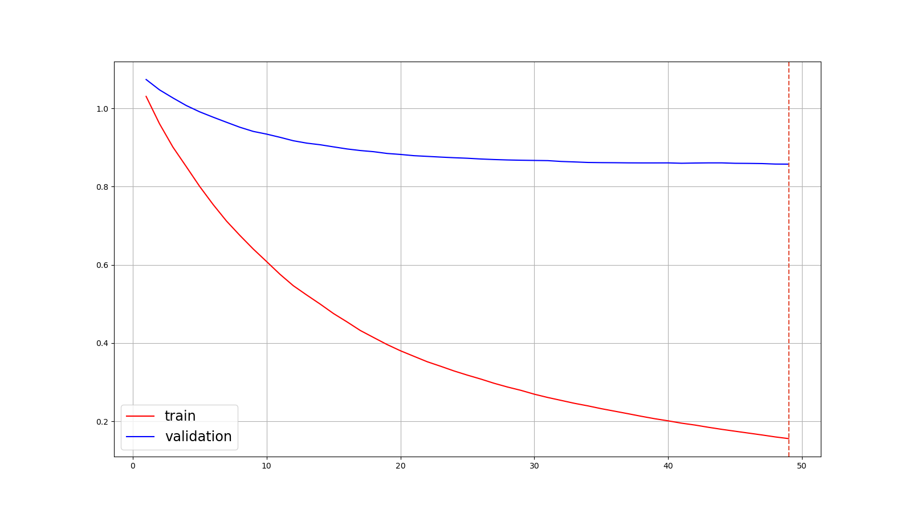

​				Figure 5: mlogloss on the train and validation dataset.

Figure 6 plots the feature importance of the model. Features with higher feature importance are regarded as more useful when making predictions. As can be seen, technical variables like`bias5`, external variables like `SPX_pct` and `north_money` all have played a large role. 

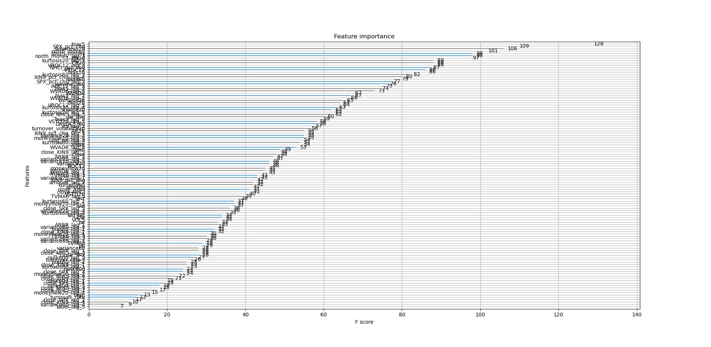

​				Figure 6: feature importance of the model

The results of XGBoost classification using a single fixed window is not satisfying. As can be seen from figure 7, at the very beginning of the test set, the model has given relatively reasonable predictions, where green dots denote up and blue ones represent oscillation. However, the following predictions deteriorate quickly as red  dots (falling) dominate the results. The model suffers from severe overfit problem, with an in sample accuracy of 100.00% and an out of sample accuracy of 43.00%.

​				Figure 7: fixed window predictions on the test set

#### 4.1.2 Rolling window

Moving window classifying dose not improve the accuracy on the test set significantly, with an in sample accuracy of 100.00% on average and an out of sample accuracy of 43.22% on average. Figure 8 displays the out of sample prediction results. In contrast to figure 1, red dots appear at the rising states, which contradicts its original implication of a falling trend.

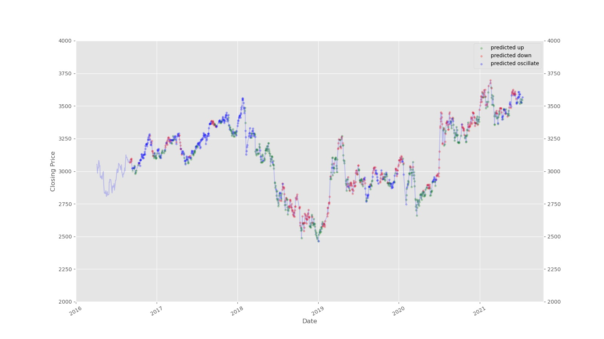

​			Figure 8: rolling window predictions on the test set

#### 4.1.3 Recursive window

The recursive window has similar performance as the previous two cases. The model has an average in sample accuracy of 100.00% and an average out of sample accuracy of 43.47%. Figure 9 plots the classification results of the test set data. As can be seen from the plot, green dots do not appear to be buying point, for some of them cluster at the falling period.

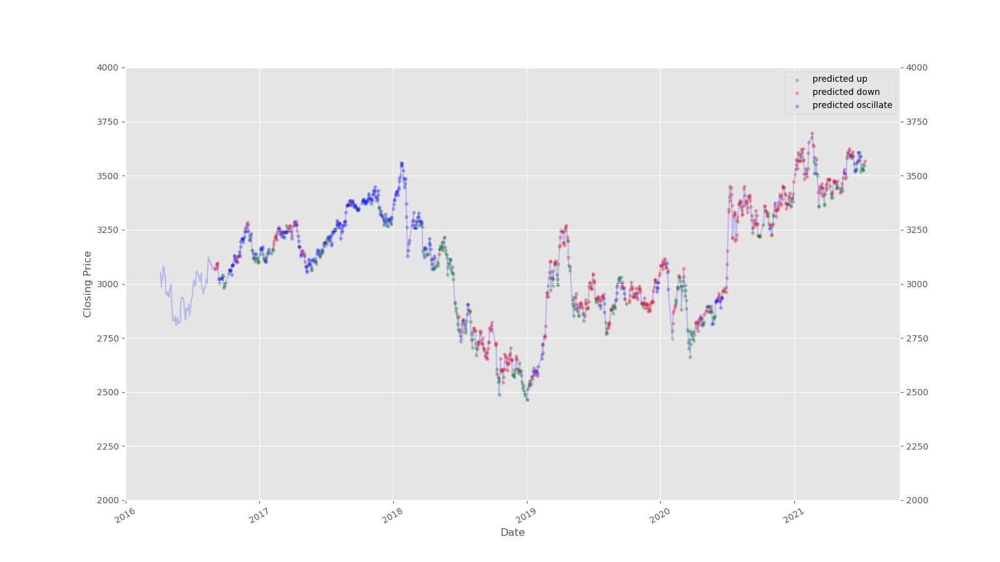

​			Figure 9: recursive window predictions on the test set

As the length of recursive windows increases over time, figure 10 plots the out of sample accuracy on every window to inspect whether the window length influences the classification performance. The plots suggest that the performance is not stable across all windows. The out of sample accuracy can be as high as 80% and as low as 10%, which is much worse than random guesses. 

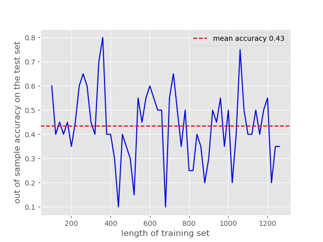

​			Figure 10: out of sample accuracy of each window

### 4.2 XGBoost Regression

As all three forms of classification do not yield satisfying results, XGBoost Regression is used in the assumption that triple barrier labelling may omit useful information of the target variable and increase the intrinsic complexity of the problem. The following part of this report all deals with the regression problem. The target variable is the next day's closing price, and the features and their lagged ones are created in the same way as above. The only difference is that, the lag takes one day instead of five days.

#### 4.2.1 Single fixed window

As before, the XGBoost regression is run on a single fixed window and the best `num_boost_round` is chosen from a five-fold validation with early-stop. Figure 11 plots the rooted mean square error on the train and validation dataset.

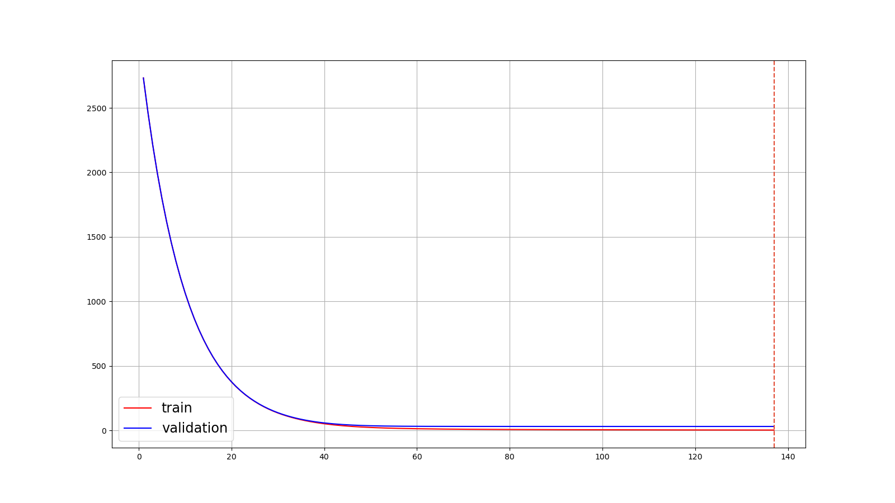

Figure 11: the rooted mean square error on the train and validation dataset

Feature importance is shown by figure 12, where variables like `open`, `SPX_pct_chg`, lags of `XIN9_pct_chg`, and etc. have larger impact to the predictions. 

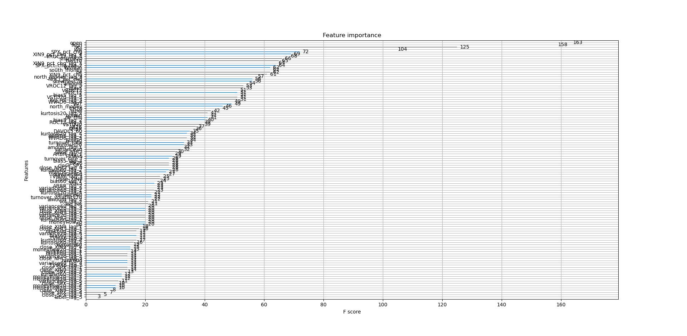

​			Figure 12: feature importance of the model

The table below lists regression errors in sample and out of sample.

Table 1: model performance 

| metrics     |  values |
| :---        |         ---: |
| in sample mean absolute error    | 3.09 |
| in sample mean squared error   | 16.45 |
| out of sample mean absolute error  | 79.16 |
| out of sample mean squared error  | 11211.20|

The fitted plot, as shown by figure 13, further visualizes the model's performance. The  blue dots fit well at the beginning of the test set. However, as time went by, its predictive capability deteriorates quickly. The phenomenon, normal as it is, highlights the importance of retraining the model timely. 

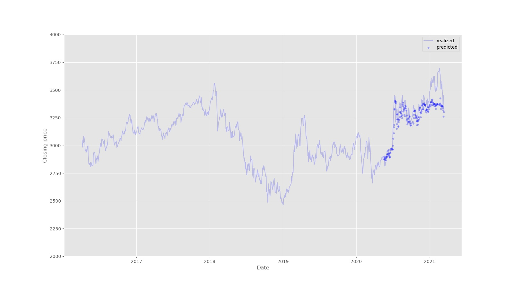

​			Figure 13: fixed window predictions on the test set

#### 4.2.2 Rolling window

The XGBoost Regressor is then trained using rolling windows. The metrics exhibited in table 2 show its improvement over the fixed one window. 

Table 2: model performance 

| metrics     |  values |
| :---        |         ---: |
| in sample mean absolute error    | 0.47 |
| in sample mean squared error   | 2.16 |
| out of sample mean absolute error  | 63.01 |
| out of sample mean squared error  | 8556.90|
| out of sample accuracy after labelling  | 44.60% |

Figure 14 plots the predicted value with the true ones, which also demonstrates its improvement over the fixed one window.

​			Figure 14: rolling window predictions on the test set

#### 4.2.3 Recursive window

Finally, the recursive window seems to give the best predictions, as it reaches an out of sample accuracy of 53.19%, which is the highest among all experiments in this paper.

Table 3: model performance 

| metrics     |  values |
| :---        |         ---: |
| in sample mean absolute error    | 2.47 |
| in sample mean squared error   | 14.98 |
| out of sample mean absolute error  | 39.58 |
| out of sample mean squared error  | 2888.93|
| out of sample accuracy after labelling  | 53.19% |

The fitted dots in figure 15 appear to lie more closely with its realized values. 

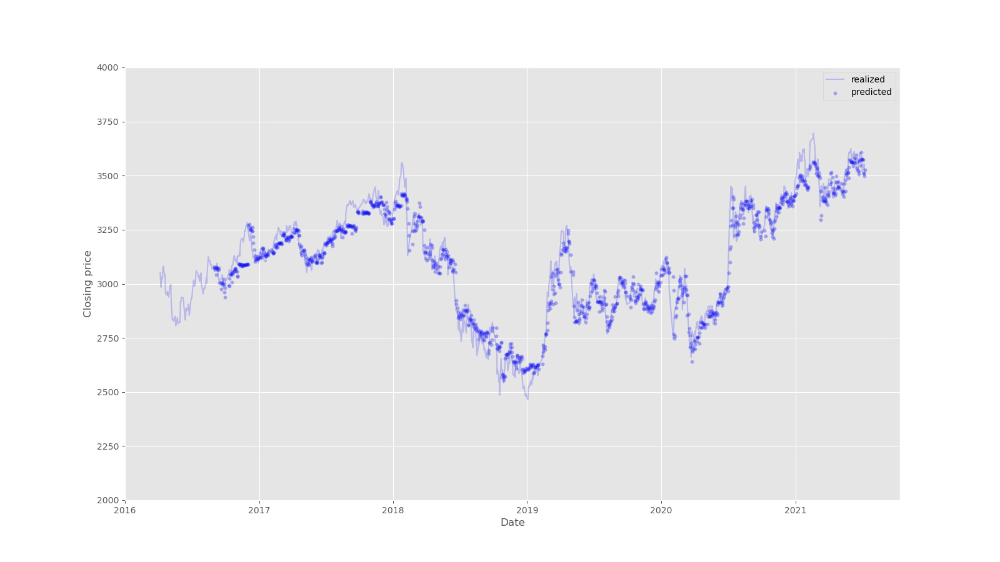

​			Figure 15: recursive window predictions on the test set

To form signals of buying and selling, triple barrier labelling is again applied to the out of sample predictions of XGBoost regressor. After labelling the predicted next day's closing price, the predicted label is again compared with its original ones to calculate accuracy. Figure 16 plots the accuracy of triple barrier classification based on rolling window predictions. The later formed labels have an out of sample accuracy of 44.60%, slightly improving previous performance. 

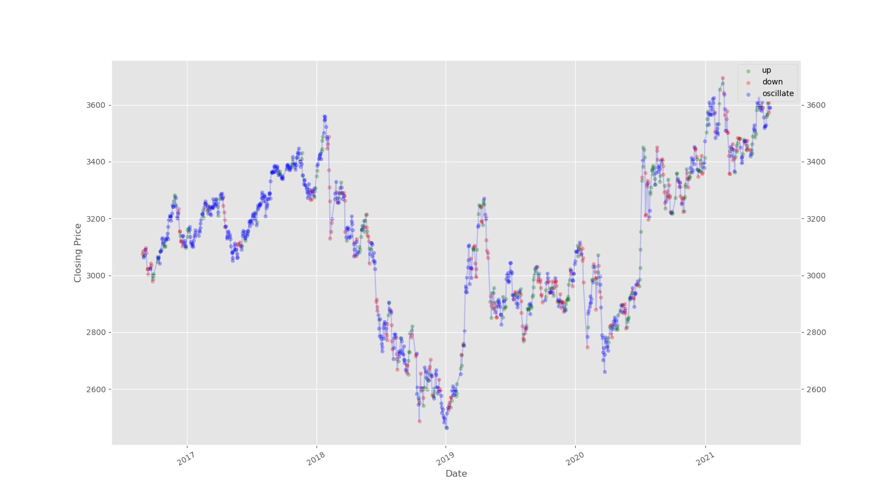

​			Figure 16: triple barrier label based of rolling window XGBoost regression

Figure 17 plots triple barrier labels which are formed on the recursive window regression's results. The result is rather satisfactory as it reaches an out of sample trinary classification accuracy of 53.19%. As can be seen from the plot, sequence of green dots appear at the rising sates while the red ones cluster at the falling states, validating its reasonability. 

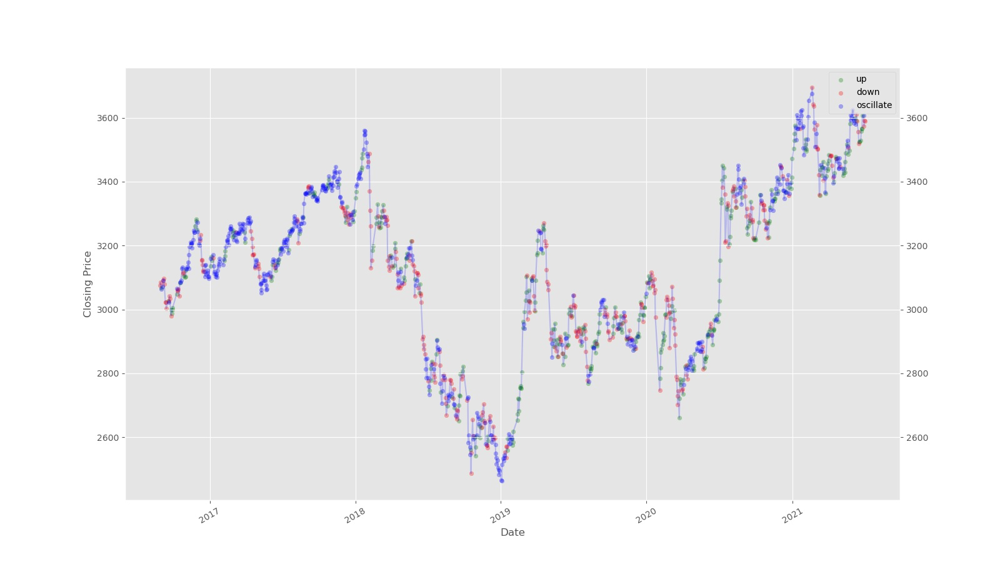

Figure 17: triple barrier label based of recursive window XGBoost regression

To further validate its predictive capability, backtest is conducted based on the triple barrier labels. The initial position is set to be 10000 in cash, the label of `1` is a buying signal, while `-1` for selling, `0` nothing will be done. All the buying and selling is conducted if only the cash or stock inventory is enough. The transaction is made at the market opening, using open prices. The transaction fees of  buying is set to be 0.05% and 2% if selling. 

Figure 18 plots the net value of the strategy. As can be seen clearly, it outperform the buy and hold strategy significantly, and its return tend to be persistent, accumulating steadily overtime. The strategy has an annualized Sharpe ratio (SR) of 1.29 and a max drawdown ratio (MDR) of 8.39%, indicating its superiority. 

Figure 18: strategy performance of XGBoost regressor on recursive windows

## 5. Conclusion

In conclusion, using XGBoost classifier and regressor, we have found predictive features to time the SSE composite index. The XGBoost regression on recursive windows seems to offer the best performance, from which signals are formed, yields an annualized Sharpe ratio of  1.29 and a max drawdown ratio of 8.39 %, taking transaction fees into consideration. 

table 4: model performance, in summary

| window type | classification (oos acc) | regression (oos mse, oos acc) | backtest (SR, MDR) |
| :---        |    :----:   |  :---: |    ---: |
| fixed one      | 43.00% | 11211.20, --- |      |
| rolling   | 43.22% | 8556.90, 44.60% |      |
| recursive  | 43.47% | 2888.93, 53.19% |1.29, 8.39%     |

## References

Marcos L{'o}pez De Prado, 2018. Advances in Financial Machine Learning. John Wiley & Sons, Inc.

## Codes and Datasets

For codes and datasets, please visit our [github repository](https://github.com/Yikiwi13/HMM-GMM-Timing-Strategy/tree/XGB). Any corrections or suggestions are highly appreciated.

## Declarations

This project is completed with the joint effort of [Likelihood Lab](http://maxlikelihood.cn) members, supported by Guangzhou Shining Midas Investment Management Co. Ltd..

